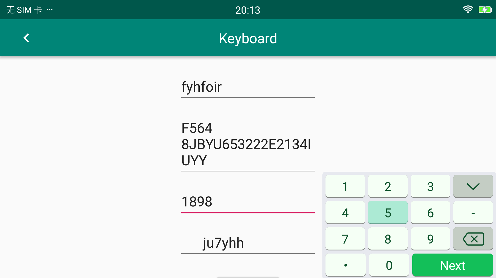
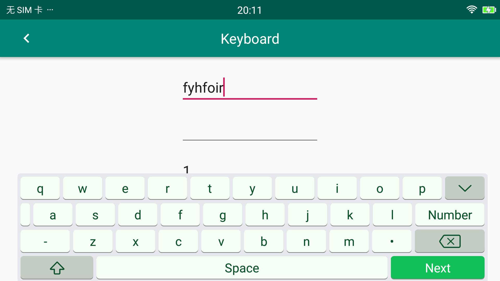
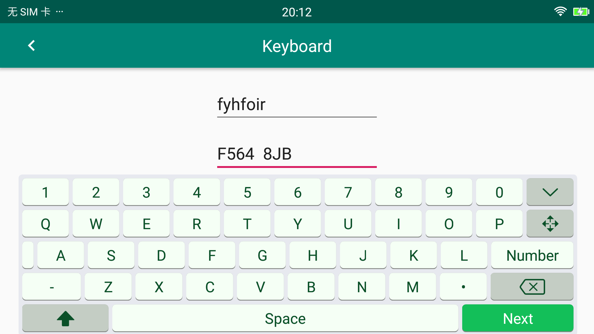
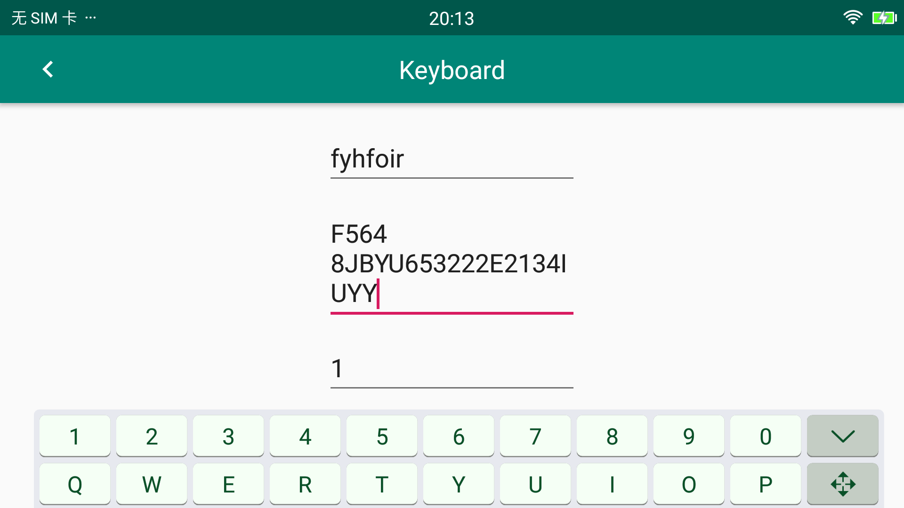

# Keyboard
[  ](https://bintray.com/justinquote/maven/keyboard-component/_latestVersion)

自定义支持拖动、支持缩放的软键盘。适用于Activity、Fragment、DialogFragment。当手指在键盘上滑动超过8pixels时就进入了拖动模式。


<a href='https://bintray.com/justinquote/maven/keyboard-component?source=watch' alt='Get automatic notifications about new "keyboard-component" versions'></a>

### 一、扫描下载体验


### 二、Screenshots
 + 1、数字键盘
 
 
 + 2、字母键盘
 
  
+ 3、字母、数字混合键盘
 
 
 + 3、被拖至底部的混合键盘
  
 
### 三、Usage
 使用要点：
 + a、创建[KeyboardView](keboardLibrary/src/main/java/jsc/kit/keyboard/KeyboardView.java)实例（支持xml布局文件）：
```
KeyBoardView keyboardView = new KeyBoardView(context);
```
+ b、管理所有需要使用该自定义键盘的`EditText`：
```
    //如果view是ViewGroup，自动查找该ViewGroup树下的所有EditText并加入管理
    public void addAllInputView(View view)

    //添加某一特定的EditText
    public void addInputView(@NonNull EditText editText)

    public void removeAllInputView(View view)

    public void removeInputView(@NonNull EditText editText)
```
+ c、把[KeyboardView](keboardLibrary/src/main/java/jsc/kit/keyboard/KeyboardView.java)添加到`Activity`、`Fragment`、`DialogFragment`所在的`Window`中：
[KeyUtils](keboardLibrary/src/main/java/jsc/kit/keyboard/KeyUtils.java)工具已提供了一个快速添加的方法。
```
KeyUtils.init(getActivity().getWindow(), keyboardView);
```
 
 + 1、Activity、Fragment。这里以`Fragment`为例：
 ```
    public View onCreateView(@NonNull LayoutInflater inflater, @Nullable ViewGroup container, @Nullable Bundle savedInstanceState) {
        View root = inflater.inflate(R.layout.fragment_keyboard, container, false);
        keyboardView = new KeyBoardView(root.getContext());
        keyboardView.addAllInputView(root);
        KeyUtils.init(getActivity().getWindow(), keyboardView);

        root.findViewById(R.id.btn_toggle).setOnClickListener(this);
        root.findViewById(R.id.btn_dialog).setOnClickListener(this);
        return root;
    }
    
        @Override
        public void onResume() {
            super.onResume();
            keyboardView.onResume();
        }
    
        @Override
        public void onPause() {
            Log.i("KeyboardFragment", "onPause: ");
            keyboardView.onPause();
            super.onPause();
        }
    
        @Override
        public void onDestroy() {
            keyboardView.onDestroy();
            super.onDestroy();
        }
```

### LICENSE
```
   Copyright 2019 JustinRoom

   Licensed under the Apache License, Version 2.0 (the "License");
   you may not use this file except in compliance with the License.
   You may obtain a copy of the License at

       http://www.apache.org/licenses/LICENSE-2.0

   Unless required by applicable law or agreed to in writing, software
   distributed under the License is distributed on an "AS IS" BASIS,
   WITHOUT WARRANTIES OR CONDITIONS OF ANY KIND, either express or implied.
   See the License for the specific language governing permissions and
   limitations under the License.
```
