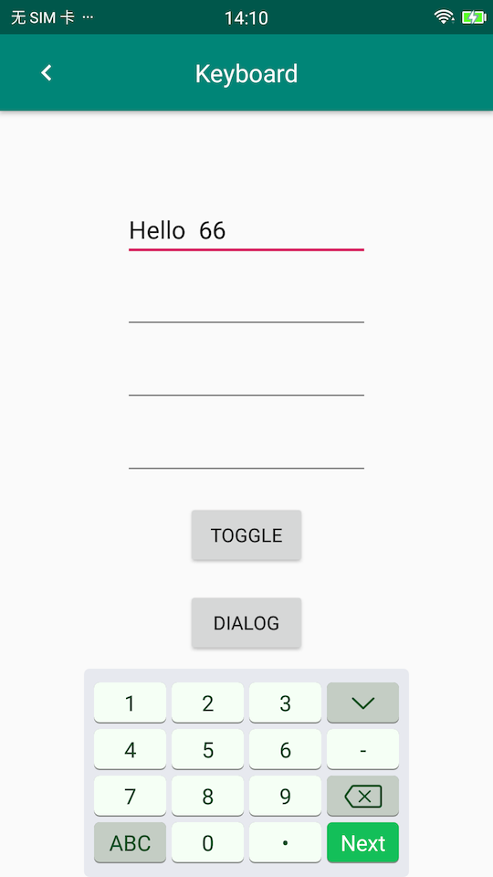

# Keyboard
[  ](https://bintray.com/justinquote/maven/keyboard-component/_latestVersion)

自定义支持拖动、支持缩放的软键盘。适用于Activity、Fragment、DialogFragment。当手指在键盘上滑动超过8pixels时就进入了拖动模式。


<a href='https://bintray.com/justinquote/maven/keyboard-component?source=watch' alt='Get automatic notifications about new "keyboard-component" versions'></a>

### 一、扫描下载体验


### 二、Screenshots
 + 1、横屏键盘效果
 
 
 
 
 
 
 
 
 + 2、竖屏键盘效果
 
 
 
 
 
 

### 三、implementation
You may implementation recycler view support package first.
```
implementation 'com.android.support:appcompat-v7:xxx'
```
+ 1.1、Gradle
```
compile 'jsc.kit.keyboard:keyboard-component:_latestVersion'
```
+ 1.2、Maven
```
<dependency>
  <groupId>jsc.kit.keyboard</groupId>
  <artifactId>keyboard-component</artifactId>
  <version>_latestVersion</version>
  <type>pom</type>
</dependency>
```

### 四、Attribution

| 名称 | 类型 | 描述 |
|:---|:---|:---|
|`keyboardType`|enum|键盘类型:`number`、`letter`、`letterNumber`。仅支持在xml布局文件中显示效果，实际会根据`EditText`的`inputType`属性显示相应的键盘类型。|
|`keyWidth`|dimension|按键的标准宽度，默认为 50dp。|
|`keyHeight`|dimension|按键的标准高度，默认为`keyWidth`的五分之三。|
|`keyHorizontalSpace`|dimension|按键水平间隙，默认为2dp。|
|`keyVerticalSpace`|dimension|按键垂直间隙，默认为2dp。|

### 五、Method

| 名称 | 返回类型 |描述 |
|:---|:---|:---|
|`initKeySize(int keyWidth, int keyHeight)`|void|初始化按键的标准宽高|
|`initKeySpace(int horizontalSpace, int verticalSpace)`|void|初始化按键水平、垂直间隙|
|`initCustomTypeface(Typeface typeface)`|void|设置按键上的字体|
|`getKeyboardSize()`|int[]|获取键盘的宽高。当键盘为隐藏状态时，宽高都为0|
|`toggleVisibility()`|void|代码调用强制显隐键盘|
|`showKeyboard()`|void|代码调用强制显示键盘|
|`closeKeyboard()`|void|代码调用强制关闭键盘|
|`toggleNumberKeys()`|void|切换字母键盘上方的数字键显隐状态|
|`setCreateKeyListener(onCreateKeyListener createKeyListener)`|void|设置创建每个按键时回调监听|
|`setKeyboardListener(OnKeyboardListener keyboardListener)`|void|设置键盘的显隐监听|
|`setKeyDownListener(OnKeyDownListener keyDownListener)`|void|自定义按键按下回调监听|
|`addAllInputView(View view)`|void|管理view树中所有`EditText`|
|`addInputView(@NonNull EditText editText)`|void|管理某个`EditText`|
|`removeAllInputView(View view)`|void|移除view树中所有`EditText`|
|`removeInputView(@NonNull EditText editText)`|void||
|`getKeyboardType()`|String|获取当前显示的键盘类型|
|`setDragSupportModel(@DragSupportModel String curDragSupportModel)`|void|设置键盘拖动方式|
|`setDefaultUpperCase(boolean upperCase)`|void|设置默认显示大小写键盘|

+ 1、键盘拖动方式
```
    public static final String ONLY_HORIZONTAL = "horizontal";//仅支持水平方向上拖动
    public static final String ONLY_VERTICAL = "vertical";//仅支持垂直方向上拖动
    public static final String ALL_DIRECTION = "all";//支持任意方向上拖动
    public static final String NONE = "none";//不支持拖动

    @StringDef({ONLY_HORIZONTAL, ONLY_VERTICAL, ALL_DIRECTION, NONE})
    @Retention(RetentionPolicy.SOURCE)
    public @interface DragSupportModel {
    }
```
+ 2、监听创建按键回调
```
    public interface onCreateKeyListener {
        /**
         * @param keyboardType current keyboard type
         * @param key          the key of view was creating
         * @return label text sie. It's unit is dp.
         */
        float getKeyTextSize(@KeyUtils.KeyboardType String keyboardType, @KeyUtils.KeyCode int key);

        void onKeyCreated(boolean isCachedView, KeyView keyView, KeyBean bean);
    }
```

+ 3、监听键盘的显隐
```
    public interface OnKeyboardListener {
        void onShow(KeyboardView keyBoardView);

        void onHide(KeyboardView keyBoardView);
    }
```

+ 4、按下按键监听
```
    public interface OnKeyDownListener {
        boolean onKeyDown(KeyboardView keyBoardView, KeyView keyView);
    }
```

### 六、Usage
 使用要点：
 + a、创建[KeyboardView](keboardLibrary/src/main/java/jsc/kit/keyboard/KeyboardView.java)实例（支持xml布局文件）：
```
KeyBoardView keyboardView = new KeyBoardView(context);
```
+ b、管理所有需要使用该自定义键盘的`EditText`：
```
    //如果view是ViewGroup，自动查找该ViewGroup树下的所有EditText并加入管理
    public void addAllInputView(View view)

    //添加某一特定的EditText
    public void addInputView(@NonNull EditText editText)

    public void removeAllInputView(View view)

    public void removeInputView(@NonNull EditText editText)
```
+ c、把[KeyboardView](keboardLibrary/src/main/java/jsc/kit/keyboard/KeyboardView.java)添加到`Activity`、`Fragment`、`DialogFragment`所在的`Window`中：
[KeyUtils](keboardLibrary/src/main/java/jsc/kit/keyboard/KeyUtils.java)工具已提供了一个快速添加的方法。
```
KeyUtils.init(getActivity().getWindow(), keyboardView);
```
 
 + 1、Activity、Fragment。这里以`Fragment`为例：
 ```
    public View onCreateView(@NonNull LayoutInflater inflater, @Nullable ViewGroup container, @Nullable Bundle savedInstanceState) {
        View root = inflater.inflate(R.layout.fragment_keyboard, container, false);
        keyboardView = new KeyBoardView(root.getContext());
        keyboardView.addAllInputView(root);
        KeyUtils.init(getActivity().getWindow(), keyboardView);

        root.findViewById(R.id.btn_toggle).setOnClickListener(this);
        root.findViewById(R.id.btn_dialog).setOnClickListener(this);
        return root;
    }
    
        @Override
        public void onResume() {
            super.onResume();
            keyboardView.onResume();
        }
    
        @Override
        public void onPause() {
            Log.i("KeyboardFragment", "onPause: ");
            keyboardView.onPause();
            super.onPause();
        }
    
        @Override
        public void onDestroy() {
            keyboardView.onDestroy();
            super.onDestroy();
        }
```

### LICENSE
```
   Copyright 2019 JustinRoom

   Licensed under the Apache License, Version 2.0 (the "License");
   you may not use this file except in compliance with the License.
   You may obtain a copy of the License at

       http://www.apache.org/licenses/LICENSE-2.0

   Unless required by applicable law or agreed to in writing, software
   distributed under the License is distributed on an "AS IS" BASIS,
   WITHOUT WARRANTIES OR CONDITIONS OF ANY KIND, either express or implied.
   See the License for the specific language governing permissions and
   limitations under the License.
```
